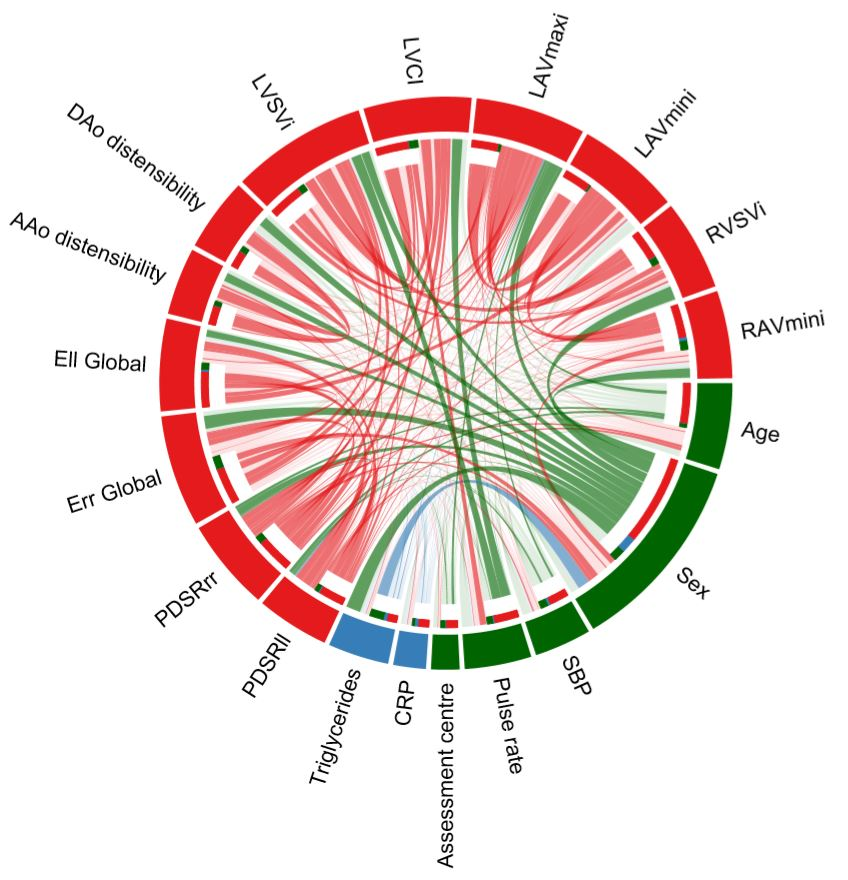

# Cardiac Phenotype associations Pipeline

## Multivariable analysis using LASSO models with model selection for selecting the imaging phenotypes
### Model selection procedure using 'BeSS'

    library(BeSS)
    # load non-imaging phenotype data
    data_ebic<-as.matrix(data_pheno)

    # using GPDAS algorithm to select the optimal k
    # PDSRll
    fit.seqll <- bess(data_ebic[,-18], data_ebic[,18], method="sequential", epsilon = 0)
    # PDSRrr
    fit.seqrr <- bess(data_ebic[,-19], data_ebic[,19], method="sequential", epsilon = 0)
    # LAVmaxi
    fit.seqlav <- bess(data_ebic[,-34], data_ebic[,34], method="sequential", epsilon = 0)

    K.opt.ebic.ll <- which.min(fit.seqll$EBIC)
    K.opt.ebic.rr <- which.min(fit.seqrr$EBIC)
    K.opt.ebic.lav <- which.min(fit.seqlav$EBIC)

    # PDSRll
    fit.one.ll <- bess.one(data_ebic[,-18], data_ebic[,18], s = K.opt.ebic.ll, family = "gaussian")
    bm.one.ll <- fit.one.ll$bestmodel
    #PDSRrr
    fit.one.rr <- bess.one(data_ebic[,-19], data_ebic[,19], s = K.opt.ebic.rr, family = "gaussian")
    bm.one.rr <- fit.one.rr$bestmodel
    #LAVmaxi
    fit.one.lav <- bess.one(data_ebic[,-34], data_ebic[,34], s = K.opt.ebic.lav, family = "gaussian")
    bm.one.lav <- fit.one.lav$bestmodel

    pheno_long<-names(bm.one.ll$coefficients)[-1]
    pheno_radial<-names(bm.one.rr$coefficients)[-1]
    pheno_lav<-names(bm.one.lav$coefficients)[-1]
    pheno_all<-cbind(pheno_long,pheno_radial,pheno_lav)

    pos_pheno<-match(rownames(pheno_all),colnames(data_ebic)) # order the position of variables selected

 ### LASSO models using 'glmnet'. The parameter of lambda.min was tuned by a 10-fold cross-validation method using 'cv.glmnet' on a training set (~67% of the original dataset).

   
    ## load data for training and for analysis
    ## covar: position of the covariates to bind with position of phenotypes for analysis
    position_stab<-rbind(covar,pos_pheno)
    
    ## Final check for collinearity using the selected variables

    model<-lm(PDSRll~., data=as.data.frame(multivar_data[,position_stab[,1]]))
    library(mctest)
    imcdiag(model,method="VIF", vif=5) # 0 if collinearity is not detected by this test
    
    Call:
    imcdiag(mod = model, method = "VIF", vif = 5)

    Call:
    imcdiag(mod = model1, method = "VIF", vif = 5)

     VIF Multicollinearity Diagnostics

                                 VIF detection
     Age                   1.8402         0
     Sex                   1.5714         0
     SBP                   1.3195         0
     `Pulse rate`          1.6389         0
     `Medication (n)`      1.0986         0
     `Assessment centre`   1.0703         0
     Triglycerides         1.1870         0
     `eGFR creatine`       1.2526         0
     PDSRrr                2.1449         0
     `Err Global`          2.0369         0
     `Ell Global`          1.4633         0
     `AAo distensibility`  3.2468         0
     `DAo distensibility`  3.2047         0
     LVSVi                 4.5634         0
     LVCI                  2.9768         0
     LAVmaxi               4.7016         0
     LAVmini               3.3255         0
     RVSVi                 2.6815         0
     RAEF                  1.5739         0

     NOTE:  VIF Method Failed to detect multicollinearity

     0 --> COLLINEARITY is not detected by the test

    ===================================

    ## Apply LASSO regression

    library(glmnet)  
    
    data.train<-as.matrix(multivar_data_train[,position_stab[,1]])

    lambda_min<-matrix(0,ncol = 1, nrow = ncol(data.train))
    for (iT in 1:ncol(data.train)){
      if (iT==2|iT==7){ # the columns with binary data
        cv<-cv.glmnet(data.train[,-iT],data.train[,iT],nfolds = 10, family="binomial", alpha=1)$lambda.min
      } else {
        cv<-cv.glmnet(data.train[,-iT],data.train[,iT],nfolds = 10, alpha=1)$lambda.min
      }
      lambda_min[iT]<-round(cv,5)
    }
    
    # LASSO model using glmnet 
    
    data_selected<-as.matrix(multivar_data_test[,position_stab[,1]])
    data_selected<-na.omit(data_selected)
    beta_gl<-matrix(0,ncol = ncol(data_selected), nrow = ncol(data_selected)-1)
    for (iS in 1:ncol(data_selected)){
      if (iS==2|iS==7){ # for the logistic regression
        cv<-glmnet(data_selected[,-iS],data_selected[,iS], family="binomial", lambda = lambda_min[iS], alpha=1)
        beta<-as.vector(t(coef(cv)))
        beta<-as.matrix(beta[-1])
    
      } else {
        cv<-glmnet(data_selected[,-iS],data_selected[,iS],lambda = lambda_min[iS], alpha = 1)
        beta<-as.vector(t(coef(cv)))
        beta<-as.matrix(beta[-1])
      }
      beta_gl[,iS]<-beta[,1]
    }

    colnames(beta_gl)<-colnames(data_selected)
    beta_gl<-as.data.frame(beta_gl)
    multivar_beta<-matrix(0,nrow = ncol(beta_gl),ncol=ncol(beta_gl))
    multivar_beta<-as.data.frame(multivar_beta)

## Circos plot  

